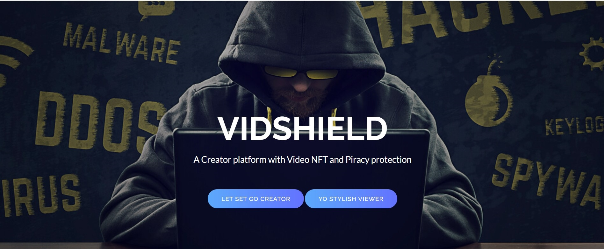

#  🔥💰VidShield 🥇😎

## 🥇 A Creator platform with Video NFT and Piracy protection 📃

## Problem Statement

In current web2 centralized video platforms, a single company owns, operates and censors the whole platform just because of its infrastructure. The platform censors the content and also takes nearly 40% of video revenue from the creator. Basically, any platform is famous due to its creators and not the platform itself. Also, video piracy is a huge issue worldwide. All efforts, money, time and energy get wasted of filmmakers if video gets pirated or stolen. The loss due to video piracy is in billions of dollars.

## Solution

VidShield is an all-in-one platform.
1) It is decentralized video platform. It creates a direct relationship between viewer and content creator. There are no user data leaks and ads. Here, viewer can upload video and its thumbnail and subscribed viewers can watch it seamlessly.

2) It is video NFT platform where creators can mint Video NFTs and sell them on Opensea marketplace.

3) It is one of the best Web3 video players. I have added a core piracy protection feature which itself will save money. Here creators are protected from any kind of video piracy. So, all hard work and sweat of the creator does not get captured by pirates. 

4) It provides smooth and gasless onboarding experience for users in just one click of a button using Biconomy. 

5) It is content creator platform where we support the creator economy. Whenever a viewer subscribes for a yearly subscription for a creator, creator gets 80% and platform gets 20% of fees. This is advantageous for viewers because they can only see their favorite creators.

6) If someone screen records, a reporting platform is also made where a genuine viewer can register a complaint about the pirate and its pirated video. If the report is genuine, the pirate will get blocked and the reporter will get bounty ethers as reward. If we incentivise reporters, piracy will nearly stop.

7) It is also NFT Marketplace for viewers to buy NFTs.

## Methodology and technology integrations

a) The video streaming and video NFT is done with the help of Livepeer API.

b) The contract is deployed on Polygon Mumbai testnet.

c) All the NFTs are fetched using Alchemy’s NFT API.

d) In contract deployment to Polygon, Alchemy’s Endpoint URL is used.

e) User can onboard the platform using gasless onboarding using Biconomy.

f) All the video thumbnails and the reporter’s pirated video is stored on Filecoin IPFS Storage.

I was successful in integrating different tech stacks in my application by deeply reading their documentation, trying their hello world projects and joining their discord community(here, most of my errors got solved). I would like to thank :[Livepeer](https://livepeer.org/)
, [Polygon](https://polygon.technology/), [Alchemy](https://dashboard.alchemyapi.io/), [Biconomy](https://www.biconomy.io/), [Filecoin](https://filecoin.io/) for the easy documentation and active community support they provide.

## NFT Collection on Opensea

[VideoNFT Collection](https://testnets.opensea.io/collection/videonft-pu1vck8z1a)

### Contract on Polygon Mumbai Testnet

VidShield - 
[0x499E4034c517a860387BB498C701064929A2BAbE](https://mumbai.polygonscan.com/address/0x499E4034c517a860387BB498C701064929A2BAbE
)

VideoNFT - [0xf376e6ac854ac55aef1017c8c557ee32ccc726f0](https://mumbai.polygonscan.com/token/0xf376e6ac854ac55aef1017c8c557ee32ccc726f0
)

### Video Demo

